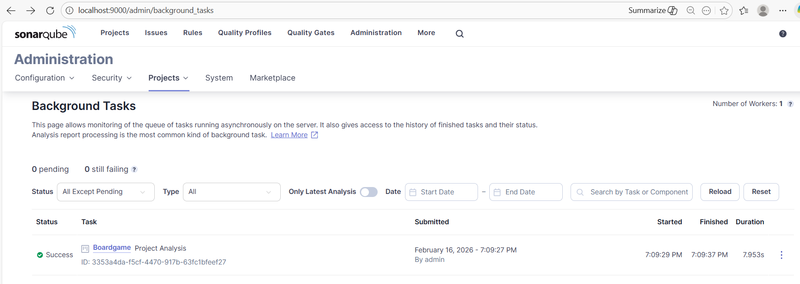
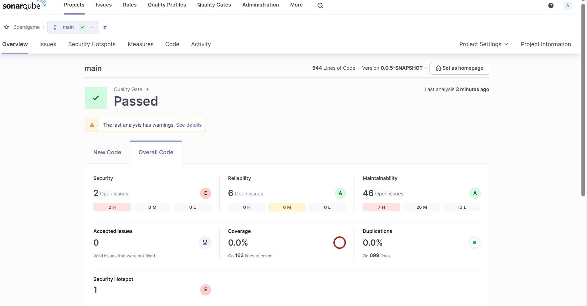
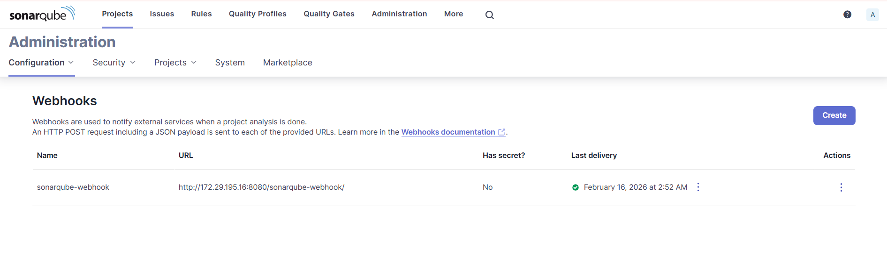
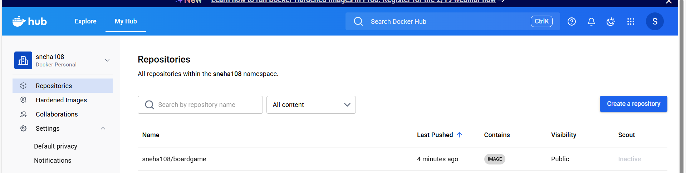
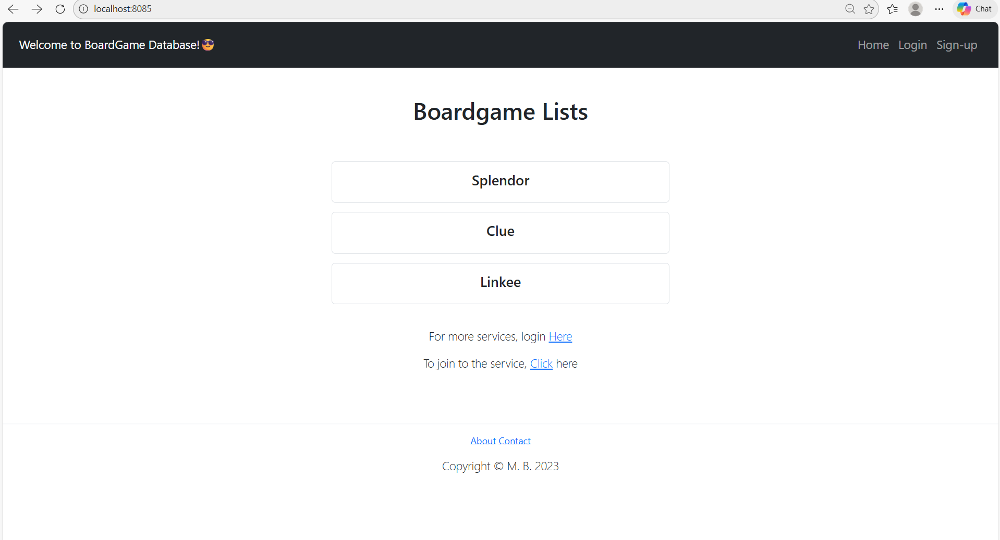

# DevSecOps CI/CD Pipeline – Boardgame Application

This project demonstrates a complete end-to-end DevSecOps pipeline built using Jenkins, SonarQube, Docker, and DockerHub for a Spring Boot application.

The base application was provided as a Java Spring Boot project. My primary focus was designing and implementing a production-style CI/CD pipeline integrating security, quality analysis, containerization, and automated deployment.

---

## Project Architecture

Developer → GitHub → Jenkins Pipeline →  
✔ Build & Test →  
✔ Gitleaks Security Scan →  
✔ SonarQube Code Analysis →  
✔ Quality Gate Validation →  
✔ Docker Image Build →  
✔ DockerHub Push →  
✔ Automated Container Deployment  

---

## Tools & Technologies Used

### CI/CD
- Jenkins (Declarative Pipeline)

### Build Tool
- Maven

### Code Quality & Security
- SonarQube (Static Code Analysis)
- Gitleaks (Secret detection)

### Containerization
- Docker (Multi-stage build)
- DockerHub (Image repository)

### Application
- Spring Boot (Java)
- H2 Database

---

## Jenkins Pipeline Stages

### 1️⃣ Code Checkout
Pulls source code from GitHub repository.

### 2️⃣ Compile
Builds the application using Maven.

### 3️⃣ Gitleaks Scan
Scans repository for hardcoded secrets or credentials.

### 4️⃣ Unit Tests
Executes automated tests.

### 5️⃣ SonarQube Analysis
Performs static code analysis:
- Code smells
- Vulnerabilities
- Bugs
- Code coverage
- Duplication

### 6️⃣ Quality Gate
Pipeline stops automatically if quality gate fails.

### 7️⃣ Package
Builds JAR artifact.

### 8️⃣ Docker Build
Creates a multi-stage optimized Docker image.

### 9️⃣ Docker Push
Pushes image to DockerHub.

### 🔟 Deployment
Stops existing container and deploys latest version automatically.

---
## Docker Image

DockerHub Repository:

https://hub.docker.com/r/sneha108/boardgame

### Run Manually

docker pull sneha108/boardgame:latest
docker run -d -p 8085:8080 sneha108/boardgame 

Application URL: http://localhost:8085

---

## 📸 Project Screenshots

### 🔹 Jenkins Pipeline Execution
Shows complete CI/CD pipeline stages execution.

---

### 🔹 Jenkins Console Output
Build logs including Maven build, Docker build & push.

---

### 🔹 SonarQube Analysis Dashboard
Static code analysis results including bugs, vulnerabilities and coverage.

---

### 🔹 SonarQube Quality Gate
Quality gate validation before deployment.

---

### 🔹 SonarQube Webhook Configuration
Webhook configuration for real-time Quality Gate feedback to Jenkins.

---

### 🔹 DockerHub Repository
Published Docker image repository.

---

### 🔹 Application Running in Docker
Application successfully running on deployed container.

